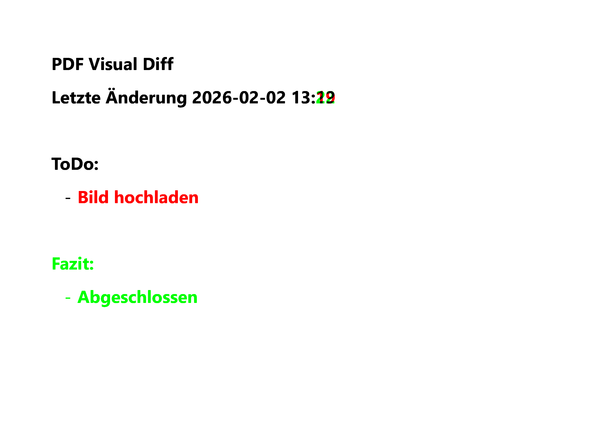

# PDF Visual Diff

Ein Open-Source-Tool zum **visuellen Vergleichen von PDF-Dateien** auf Pixelebene.

Die PDF-Dateien werden seitenweise gerendert und anschließend als Bilder
pixelgenau miteinander verglichen. Auf diese Weise werden Unterschiede im
sichtbaren Inhalt der Dokumente zuverlässig erkannt, unabhängig von der
internen Struktur der PDF-Dateien.

Unterschiede werden farblich hervorgehoben:

- ⚫ **Schwarz** -> identischer Inhalt
- 🔴 **Rot** -> nur in PDF 1 vorhanden
- 🟢 **Grün** -> nur in PDF 2 vorhanden
- ⚪ **Weiß** -> Hintergrund

---

## Beispielbild:

---

## ✨ Features

- Pixelgenauer Vergleich auf Seitenbasis
- Funktioniert mit gescannten PDFs
- Optionaler **Content-only-Modus**
  - Hintergrund bleibt weiß
  - nur Text & Bilder werden verglichen
- Vollständig lokal (keine Cloud, kein Upload)
- Reproduzierbare, nachvollziehbare Ergebnisse

---

## 📦 Installation

### Python-Abhängigkeiten

#### MacOS

pip install pdf2image pillow numpy
brew install poppler

## 🚀 Verwendung (CLI)

### Grundaufruf

python pdfdiff.py datei1.pdf datei2.pdf

#### Ergebnis

diff_out/diff_page_1.png
diff_out/diff_page_2.png
...

### Output-Verzeichnis setzen

python pdfdiff.py datei1.pdf datei2.pdf --out results

### Content-only-Modus aktivieren

- Vergleicht nur schwarzen Inhalt (Text & Bilder). Der Hintergrund bleibt weiß.
  python pdfdiff.py datei1.pdf datei2.pdf --content-only

### Komplettvergleich (inkl. Hintergrund)

python pdfdiff.py datei1.pdf datei2.pdf --full

## 🧠 Funktionsweise

1. Jede PDF-Seite wird mit Poppler in ein Bild gerendert
2. Bilder werden:

- in Graustufen konvertiert
- leicht entrauscht
- binarisiert (Schwarz / Weiß)

3. Pixelweiser Vergleich der Seiten:

- identisch -> schwarz
- nur PDF 1 -> rot
- nur PDF 2 -> grün

4. Ausgabe als PNG (eine Datei pro Seite)
